# CodeBook — Technical Book Writing Software & System Bible Editor

**An offline writing app for technical books, game design documents, and system bibles.**

CodeBook is a free, open-source **technical book writing app and system bible editor for Windows**. Organize chapters or deeply nested systems, write in a rich-text editor, paste formatted content from ChatGPT or the web, and edit code examples with syntax highlighting. Track each section with a topic icon and progress status. Export your manuscript or game design document to formatted PDF, Markdown, or HTML when you are ready to share it.

Built for programming-book authors, technical writers, game designers, educators, developers, and tutorial creators. No account or internet connection is required for the core writing workflow.

**[Download CodeBook for Windows](https://github.com/dontwatchmedia/Codebook/releases/latest)** · **[Download the EXE](https://github.com/dontwatchmedia/Codebook/releases/latest/download/CodeBook.exe)** · **[Report a bug](https://github.com/dontwatchmedia/Codebook/issues)**

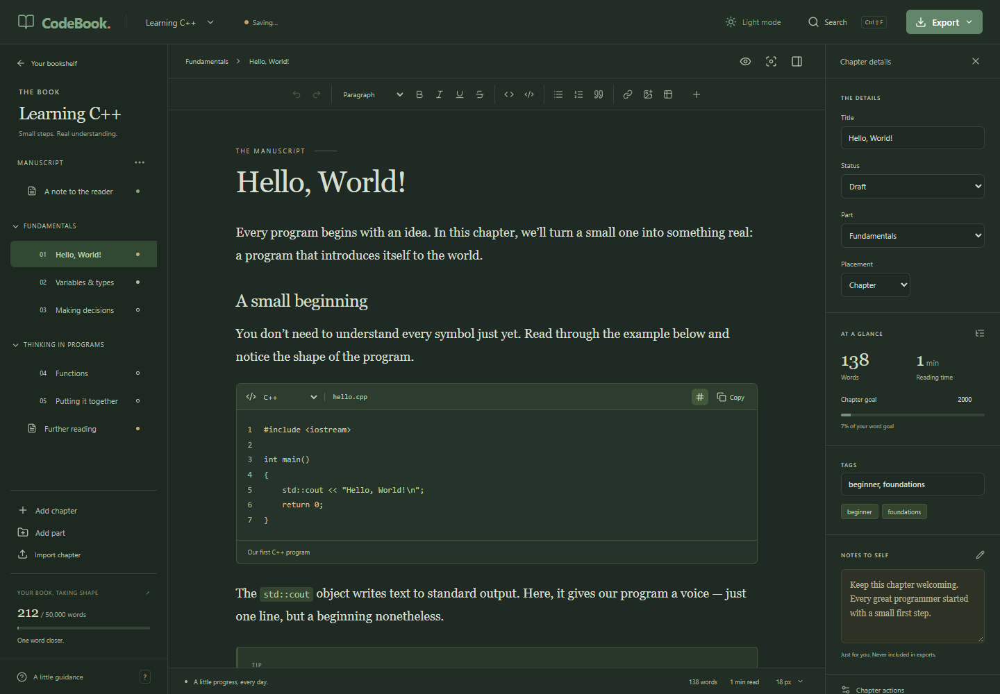

## Why CodeBook?

Writing a programming book or game system bible means moving between prose, code, and connected ideas. CodeBook brings them into one writing space: an outline on the left, your writing in the center, and section details on the right. A system can have its own overview and contain sub-systems, features, and further layers as the design grows.

- **Write like an author.** Work with books, parts, and chapters through a familiar visual editor.
- **Organize a living design.** Build a system bible with nested sections, topic icons, and visible progress states.
- **Make the space yours.** Resize the left panel, zoom its text with Ctrl+wheel, hide its lower tools, use compact writing, choose from eight color themes, and search 3,773 section emoji.
- **Treat code as content.** Give code blocks a language, filename, and optional line numbers.
- **Keep pasted structure.** Preserve headings, lists, links, tables, inline code, and fenced code blocks from supported rich text and Markdown.
- **Keep growing.** Incremental desktop saves, cached document totals, responsive search, and a virtualized outline support large writing projects. Benchmarked with 700,000 words and up to 2,000 sections; see [performance evidence](VALIDATION.md#large-project-performance).
- **Keep your work local.** Save structured project files on your computer, with autosave, recovery journals, and backup snapshots.
- **Take your manuscript with you.** Export a formatted PDF, readable HTML, portable Markdown, or a complete `.codebook` project.

## Download and start writing

1. Download **[CodeBook.exe](https://github.com/dontwatchmedia/Codebook/releases/latest/download/CodeBook.exe)** or the portable ZIP from the **[latest release](https://github.com/dontwatchmedia/Codebook/releases/latest)**.
2. If you downloaded the ZIP, extract it first.
3. Double-click **CodeBook.exe**.
4. Open the editable **Learning C++** sample, choose **New book**, or choose **New system bible**.

The latest executable is also available directly in the [repository root](CodeBook.exe). If you downloaded the repository as a ZIP, extract the folder and open it there, or use **Open CodeBook.cmd**.

**Requirements:** 64-bit Windows 10 or Windows 11 with the [Microsoft Edge WebView2 Runtime](https://developer.microsoft.com/microsoft-edge/webview2/). The desktop download does not require Node.js, Rust, or a development server. The current executable is unsigned and may show a Windows security prompt. Windows is the tested platform; macOS and Linux packages are not provided.

## Features

### Book and chapter organization

- A bookshelf for creating, opening, renaming, and managing books and system bibles.
- Drag the left panel's right edge to make the outline wider or narrower. CodeBook remembers your chosen width after restarting. Double-click the divider to reset it; when focused, use Left/Right arrows to resize, Shift for larger steps, and Home/End for the available limits.
- A compact header places the project title beside **Your bookshelf**, with tighter rows for chapters and nested sections. Hold **Ctrl** and use the mouse wheel over the left panel to change outline text and emoji from **80% to 200%**, independently of writing zoom. The **− / percentage / +** controls offer the same adjustment; clicking the percentage resets to 100%.
- Use **Expand all sections** / **Collapse all sections**, or individual branch arrows. **Tools** collapses the lower add/import/progress/help area. Zoom, footer choice, and collapsed branches are remembered locally. Total words and the page counter stay visible when the tools are hidden.
- Double-click a project title in the left sidebar, or a chapter, section, or part title in the outline, to rename it. Enter saves, Escape cancels, and clicking away saves a valid name. F2 also starts renaming.
- Choose from **3,773 offline emoji** beside each chapter number or section icon, including flags, skin tones, and joined emoji. Familiar progress and topic symbols remain first.
- Search emoji names, keywords, partial words, or a pasted emoji. Try **done**, **wip**, **dragon**, **farming**, or **dark skin scientist**. Searches ignore capitalization and accents, and match all the words you enter.
- Filter by category, browse more results, or use the keyboard: Down moves from search into the grid, arrows move between choices, Enter selects, and Escape closes. You can still paste a single custom emoji or clear it; numbering and progress stay independent.
- Parts, chapters, front matter, and back matter.
- Drag a chapter or section by its title. Drop on a row's top or bottom edge to reorder it; drop in the middle to nest it inside that chapter, section, or part. Children move with their parent in both books and system bibles.
- Drop a branch on **Move to top level** to promote it. The outline shows insertion lines or an inside highlight, and blocks drops that would put a parent inside its own descendant.
- Automatic chapter numbering and keyboard-accessible move actions.
- Book metadata, author name, subtitle, cover color, and word goals.

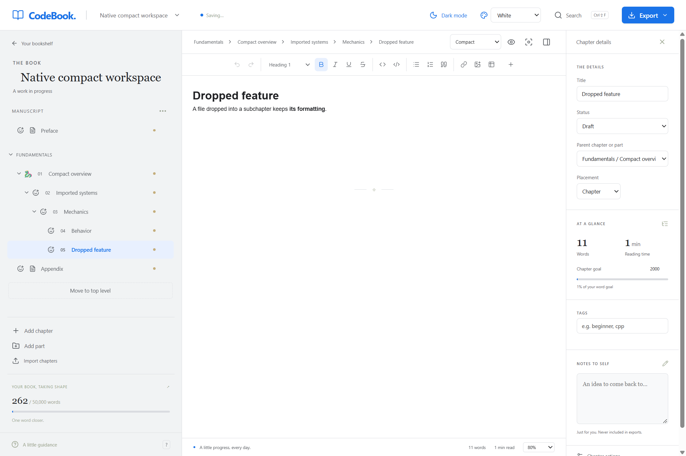

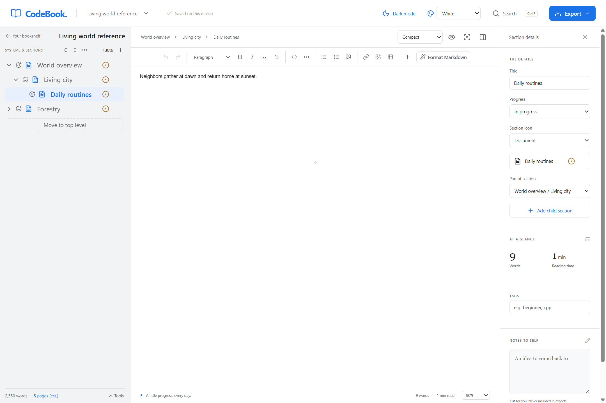

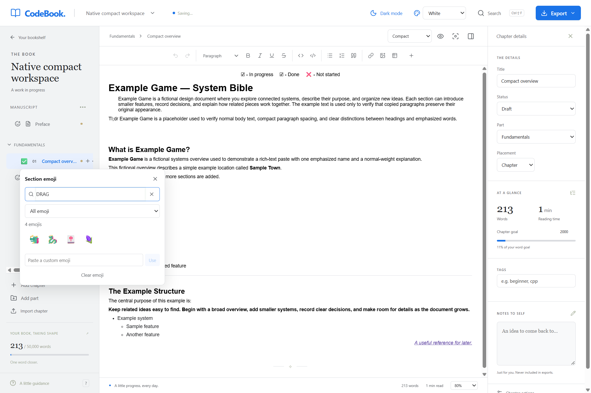

### Nested system bibles and game design documents

- A **System bible** project type with an editable overview, systems, sub-systems, features, and deeper sections.
- Every section can contain writing and child sections; a parent does not have to be an empty folder.
- Expand or collapse branches to keep a growing design readable.
- Move a section and its entire branch using **Parent section**. Reorder siblings with drag-and-drop or move actions.
- Deleting a parent section keeps its child sections and their writing, promoting them one level higher.
- Choose from ten topic icons: document, layers, gamepad, globe, people, leaf, hammer, code, lightbulb, and flag.
- Set **Not started**, **In progress**, **Complete**, **Blocked**, or **On hold** for each section. Progress is set independently; changing a child does not automatically mark its parent complete.
- Markdown and HTML exports preserve the nested outline, section icons, progress labels, and content at every layer. Numbered paths identify sections beyond six heading levels.
- Existing books still open. Switching project type preserves their writing and hierarchy.

### Start a system bible

1. Choose **New system bible** on the bookshelf, enter a title, and create the project. The **New book** dialog also offers a system-bible template under **Start with**.
2. Write your main description in **Overview**.
3. Select a section and choose **Add child section** to add a system, sub-system, or feature below it. Repeat as the design develops.
4. Use the details panel to choose a **Section icon** and **Progress** state.
5. To move an existing branch, change its **Parent section**. Choose the top level when it should stand on its own, or select another section to nest it there.

To use an existing book as a system bible, open its settings beside the project title, change **Project type** to **System bible**, and save. You can switch back to **Book** later without removing nested sections.

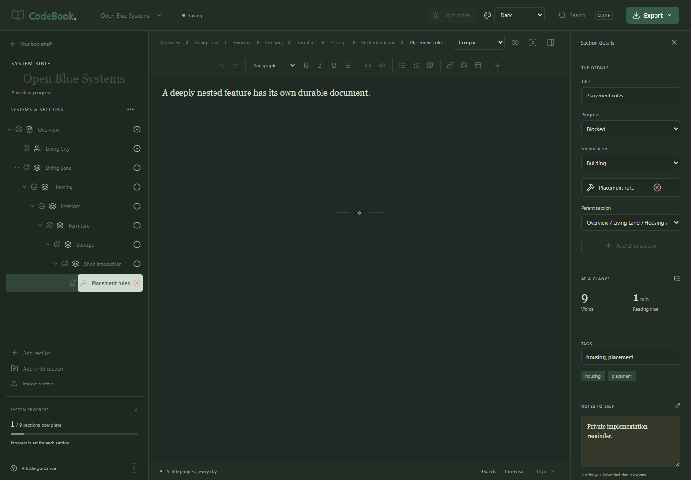

### Rich-text writing

- Headings, paragraphs, bold, italic, underline, strikethrough, links, and inline code.
- Bulleted and numbered lists, blockquotes, images, editable tables, and callouts.
- A formatting toolbar, slash insert menu, and command palette.
- **Format Markdown** turns pasted `## headings`, `**bold**`, lists, links, tables, and fenced code into editable rich text with Google Docs-style typography. Select a passage to convert it, or leave nothing selected to format the current chapter or section. Use Undo to restore the original text.
- Chapter writing status, section progress, tags, private notes, word counts, and estimated reading time.
- Find and replace with highlighted matches, nested section paths, and project-wide navigation.

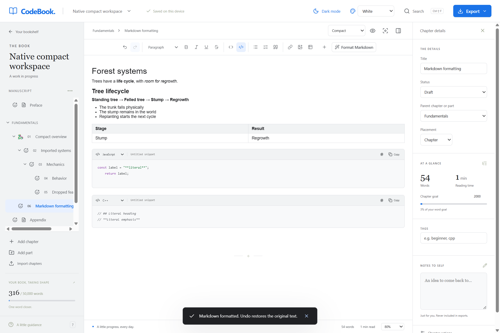

### Find writing and resume where you left off

- Press **Ctrl+F** or click **Search**. Find starts in the current chapter or section, then continues through the project and wraps around. Results show each section's full ancestor path, match count, and text snippets.
- Matching text is highlighted in the open document, with a distinct highlight for the current match. Use **Enter** for the next match and **Shift+Enter** for the previous one, or choose a result directly.
- The Find panel keeps its query and each section's current match when you switch sections manually. **Replace** and **Replace all** change only the **current chapter or section**; use Undo to restore the change.
- Each chapter or section remembers its scroll position and caret or text selection. Reopening a project resumes its last visited section. Reading positions are local preferences, separate from the exported project; the latest position may be lost after a forced app shutdown.
- **Ctrl+Shift+F** opens the advanced project search with text, code, and tag filters.

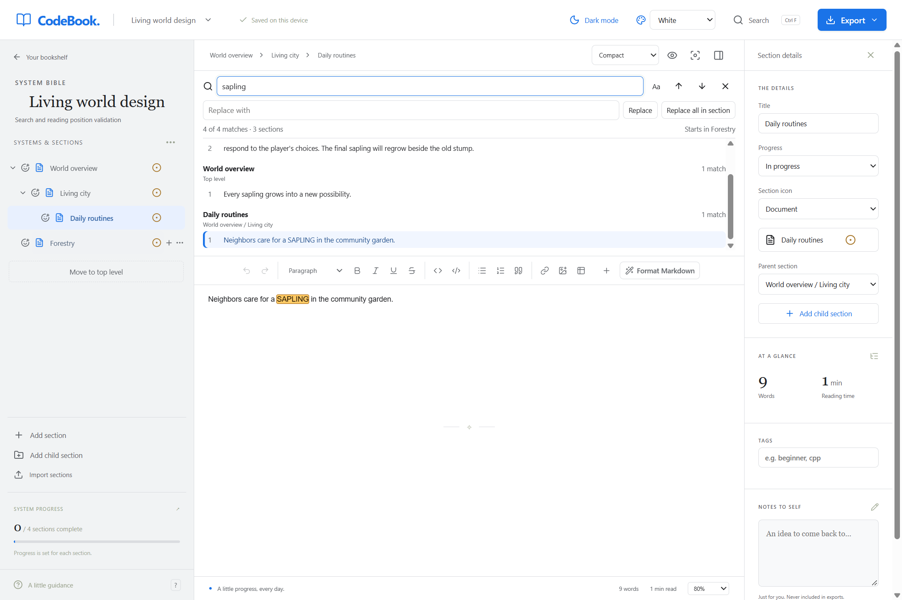

### Code examples and formatted paste

- Syntax-highlighted code blocks with automatic language detection.
- 20 language choices, including C++, Python, JavaScript, TypeScript, Rust, Go, Java, C#, SQL, Bash, and PowerShell.
- Editable code filenames, optional line numbers, indentation, and a copy button.
- HTML, Markdown, plain-text, and native CodeBook clipboard support.
- Google Docs paste retains supported fonts, point sizes, selective bold, colors, alignment, paragraph spacing, and nested lists.
- Imported typography stays with your project after saving and reopening. HTML and `.codebook` exports retain it; Markdown keeps semantic formatting such as headings, bold, and lists.
- Sanitization of imported HTML to remove scripts and unsafe markup.

### Import Markdown files as chapters

1. Open a book or system bible and choose **Import chapters** or **Import sections**. Select one or several `.md` or `.markdown` files; each becomes an editable chapter or section.
2. Alternatively, drag the files from File Explorer onto an outline row. Its middle imports them as children; its top or bottom edge imports them as siblings. Drop on **Move to top level** for root chapters.
3. Drag the imported chapters into the organization you need, including chapters, subchapters, systems, and deeper features.

The first H1 supplies the chapter title when present; otherwise CodeBook uses the filename. Headings stay in the document. Markdown uses **Arial 11pt** prose and **22pt / 16pt** main headings, with 1.15 line spacing and compact paragraph gaps to match the Google Docs-style writing we've established. Lists, emphasis, links, blockquotes, tables, dividers, inline code, and fenced code retain their structure; code language and whitespace remain intact. Task-list states are retained as **☑ / ☐** text markers.

Remote and embedded images remain supported. Local companion images retain their captions and paths as visible references; their files are not automatically embedded. HTML imports retain their supported source typography, and TXT imports remain plain text.

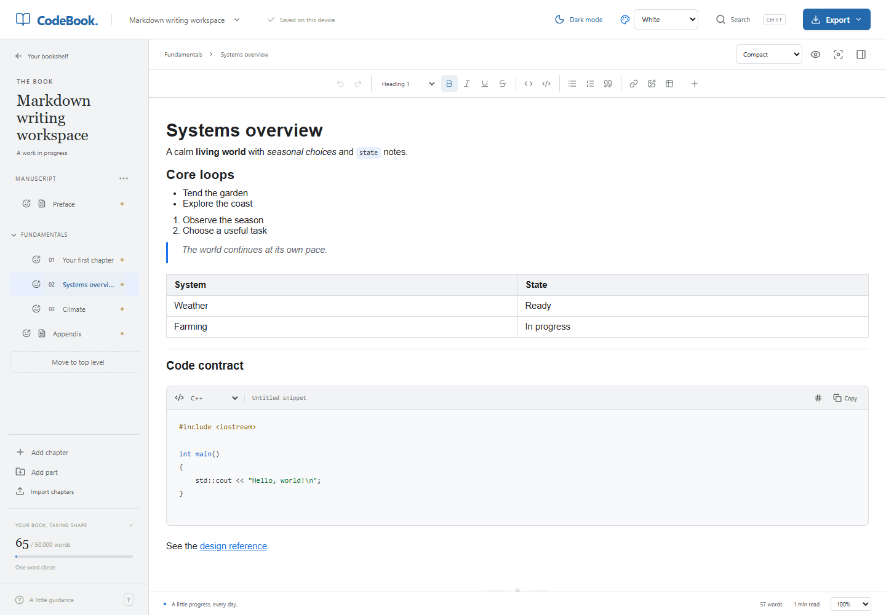

If an earlier paste became entirely bold or lost its font, update CodeBook and paste the original selection again. Earlier versions did not store the discarded source formatting.

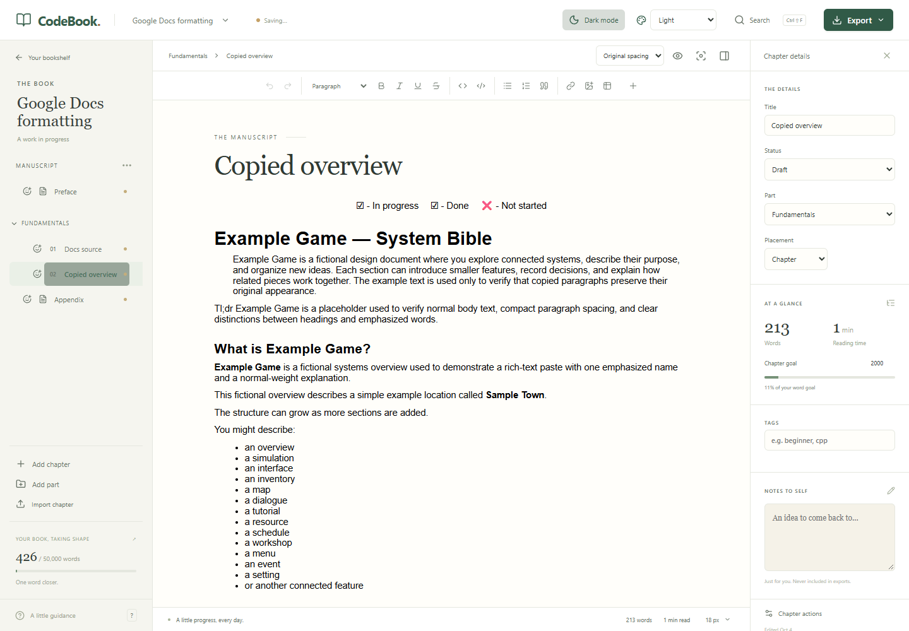

### A comfortable writing environment

- **Eight color themes:** choose Light, White, Sepia, Dark, Midnight, Ocean, Rose, or Lavender in **Color theme** at the top right, or **Preferences → Appearance**. **White** offers pure white paper, neutral gray panels, and blue accents similar to Google Docs. Your choice is remembered after restarting. The moon/sun button remains a quick light/dark switch.
- **Compact layout:** use more of the editor width, with tighter paragraph gaps, shorter blank lines, and reduced spacing around dividers. It applies to existing documents immediately. Choose **Original spacing** above the editor to restore their stored spacing; saved content and exports retain the original typography in either view.
- **Writing zoom:** choose a percentage below the editor to scale the entire document, including pasted text. If your source browser or Google Docs is at **80%**, use **80%** here to match its display. Zoom is remembered after restarting and leaves saved font sizes, clipboard formatting, and exports unchanged. **100%** restores the normal display scale.
- Focus mode, reading preview, typewriter mode, and an adjustable default text size for writing without its own font size.
- No login, subscription, cloud account, or AI service is required.

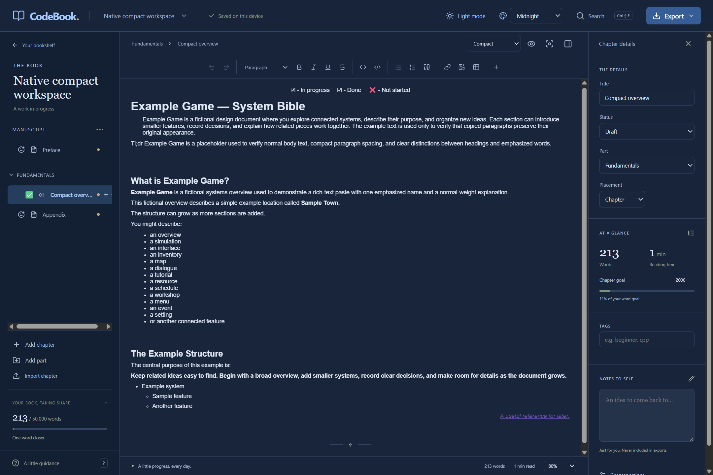

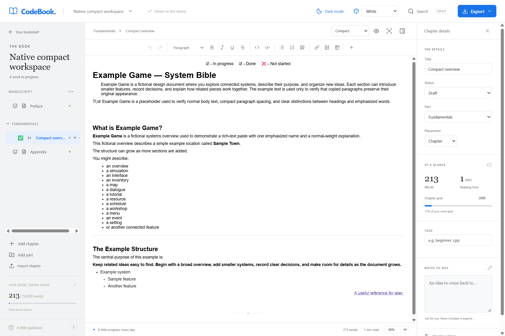

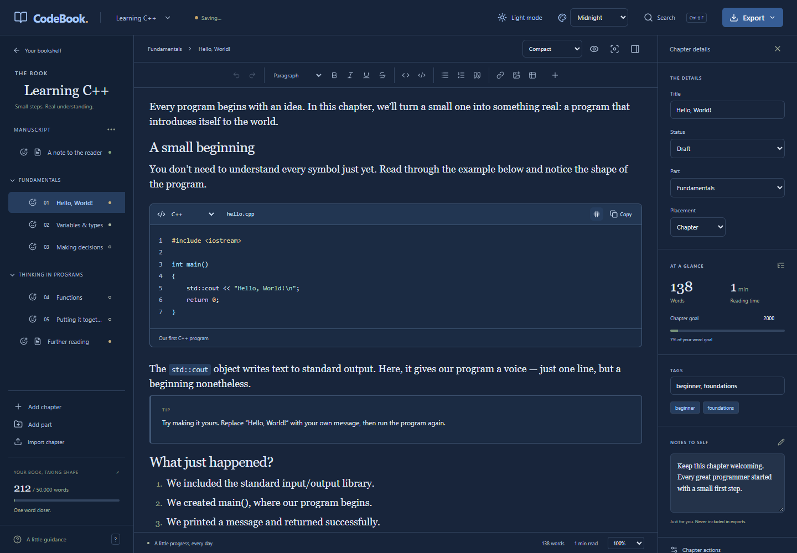

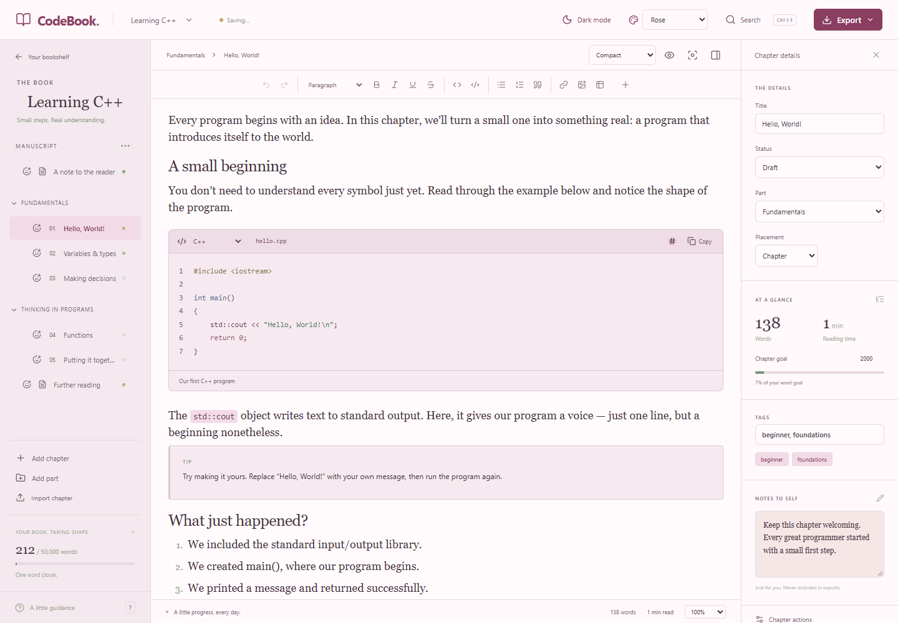

### Autosave, recovery, and export

- Autosave after a short pause in typing.
- Atomic file replacement and a separate recovery journal.
- Up to 30 automatic backup snapshots per project, with a restore interface.
- Markdown export for portability and HTML export with highlighted code and a table of contents.
- Formatted PDF export with selectable text, supported typography, code, lists, tables, and images.
- Complete `.codebook` project export, including nested sections, icons, progress, notes, and code metadata.
- Import Markdown, HTML, and plain-text files as new chapters or sections; import a `.codebook` file as an independent project.

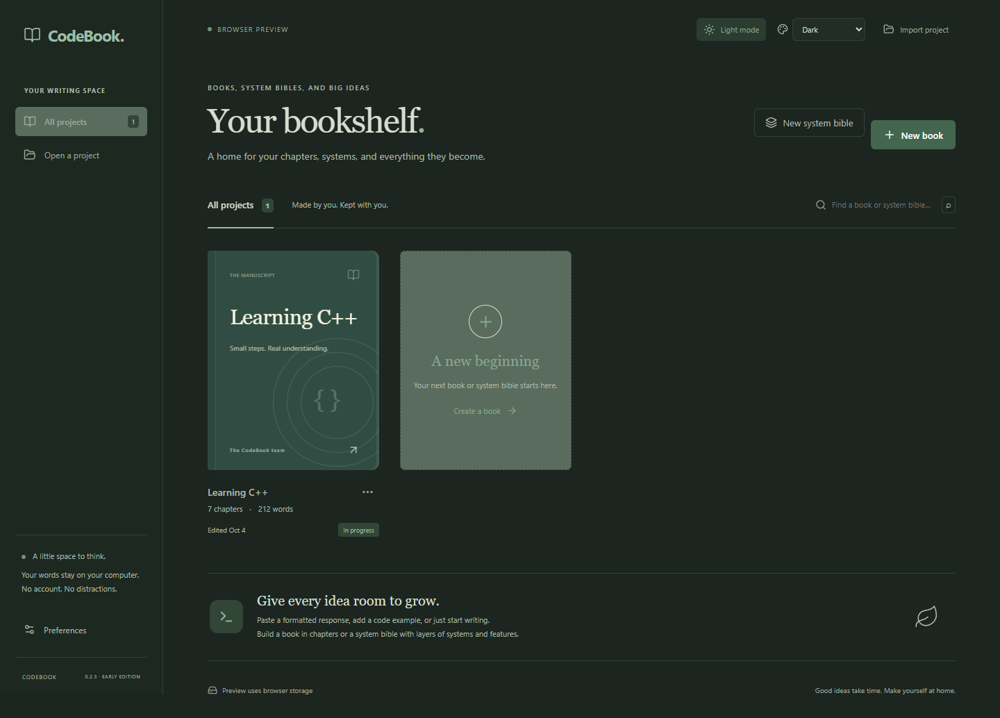

### Export a formatted PDF

Choose **Export → PDF → Preview PDF**, or click the page counter below the outline. Select **Letter** or **A4** paper with 0.55-inch margins, and choose whether to include the project title, start each chapter or section on a new page, and show page numbers. In the Windows app, wait for preparation and click **Save PDF**.

**Compact spacing** is checked by default to keep the tighter Google Docs-style spacing around imported paragraphs, headings, and dividers. Uncheck it to retain the document's original spacing. Font sizes and text formatting stay intact in either mode.

The outline shows a live **estimated** page count while you write. Preparing the native PDF supplies the **exact** count for that document and those settings. Editing the project or changing settings invalidates that exact count until another PDF is prepared. The in-app content preview is continuous HTML; view the saved PDF for its actual page breaks. The browser development preview uses **Print / Save as PDF** and keeps its page count labeled as an estimate.

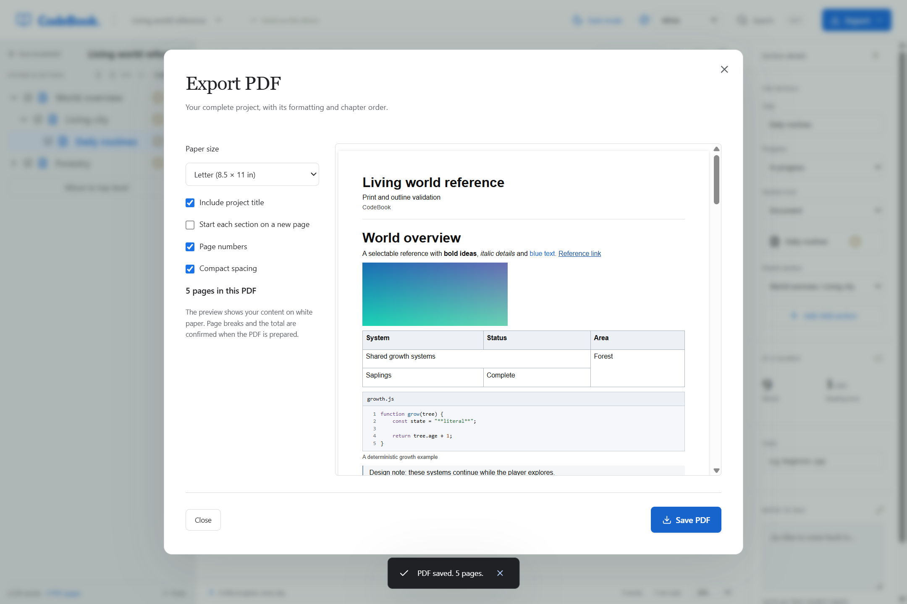

## Your files stay on your computer

Books and system bibles are stored in your Windows application-data directory. **Preferences** shows the exact location; the usual path is:

```text
%APPDATA%\com.codebook.desktop\books\
```

Each project uses structured JSON rather than an opaque manuscript format. The desktop app journals only changed content through flushed, atomic writes. After a 650 ms pause it saves the main project on a background worker, so serializing the manuscript does not block typing. The Saved indicator waits for all queued saves to finish. It keeps up to 30 snapshots, captured at most once every five minutes while editing.

**Export → CodeBook project** creates a portable backup with your writing, hierarchy, section icons and progress, embedded images, code metadata, and private notes. Markdown and HTML exports exclude private notes and tags.

Locally inserted image files are embedded in the project. Images pasted as remote URLs still need their source to load; insert the image file for offline use. The browser development preview has a separate library in browser storage. Transfer projects between it and the desktop app through `.codebook` export/import.

## Keyboard shortcuts

| Action                    | Shortcut                                 |
| ------------------------- | ---------------------------------------- |
| Bold / italic / underline | `Ctrl+B` / `Ctrl+I` / `Ctrl+U`           |
| Insert a link             | `Ctrl+K`                                 |
| Undo / redo               | `Ctrl+Z` / `Ctrl+Y`                      |
| Heading 1–3               | `Ctrl+Alt+1`–`3`                         |
| Find across the project   | `Ctrl+F`                                 |
| Next / previous match     | `Enter` / `Shift+Enter` in Find          |
| Advanced project search   | `Ctrl+Shift+F`                           |
| Command palette           | `Ctrl+Shift+P`                           |
| Save now                  | `Ctrl+S`                                 |
| Leave focus mode          | `Esc`                                    |
| Outline text zoom         | `Ctrl+mouse wheel` over the left panel    |
| Insert a block            | Type `/` at the beginning of a paragraph |

## Current release and roadmap

CodeBook **0.2.11** optimizes large manuscripts with incremental native saving, cached statistics and editor updates, a virtualized outline, and cancellable searches that reuse unchanged sections. Compact outline controls, word/page totals, and formatted PDF export remain available. It includes Smart Find, remembered reading positions, Format Markdown, a resizable outline, multiple Markdown-file import with Google Docs-style typography, nested drag-and-drop, 3,773 searchable offline emoji, writing zoom, eight color themes, and double-click title renaming.

**Available now:** deeply nested sections, topic icons, section progress, rich-text editing, code highlighting, formatted paste, dark mode, local autosave and recovery, book organization, search, and PDF/Markdown/HTML export.

**Not included yet:** EPUB, DOCX, AI writing tools, cloud synchronization, collaboration, comments, equations, diagrams, cross-references, and advanced publishing layouts. These are possible future features, not current capabilities or promised release dates.

Markdown preserves supported writing blocks and a system bible's numbered hierarchy. Use `.codebook` for an exact project backup, including organization and metadata. The Windows app has been benchmarked with 172,000–700,000 words, up to 2,000 sections, and a 60,000-word individual section. See [timings, hardware, and limits](VALIDATION.md#large-project-performance). Opening a very long individual chapter still requires rendering its content, and image-heavy projects and multi-thousand-page PDF generation are not covered by these typing benchmarks. The browser development preview uses browser storage and does not have the native incremental save path.

## Build from source

CodeBook uses **Tauri 2, Rust, React, TypeScript, Tiptap/ProseMirror, and lowlight/highlight.js**.

For frontend development, install Node.js 22.12+ and npm. Node.js 24 was used for validation.

```powershell
git clone https://github.com/dontwatchmedia/Codebook.git
cd Codebook
npm.cmd ci
npm.cmd run dev
```

Open the local URL printed by Vite to use the browser preview.

For the native Windows app, install the [Tauri Windows prerequisites](https://v2.tauri.app/start/prerequisites/), including Rust, the MSVC C++ build tools, and WebView2:

```powershell
powershell -ExecutionPolicy Bypass -File scripts/desktop.ps1 dev
powershell -ExecutionPolicy Bypass -File scripts/desktop.ps1 build
powershell -ExecutionPolicy Bypass -File scripts/package.ps1
```

Packaging places the current **CodeBook.exe** in the project root and creates the portable ZIP in `release/`. It includes only the current executable, documentation, screenshots, licenses, and checksum. Previous executable copies, development dependencies, local books, and test data are excluded. Unicode emoji data and English CLDR names are bundled under the license in [THIRD_PARTY_NOTICES.md](THIRD_PARTY_NOTICES.md); emoji search makes no network requests.

## Tests

```powershell
npm.cmd run build
npm.cmd test
npm.cmd run test:e2e
powershell -ExecutionPolicy Bypass -File scripts/desktop.ps1 test
node scripts/native-smoke.mjs CodeBook.exe
node scripts/native-search-smoke.mjs CodeBook.exe
node scripts/native-outline-pdf-smoke.mjs CodeBook.exe
node scripts/native-delta-recovery-smoke.mjs CodeBook.exe
node scripts/performance-smoke.mjs CodeBook.exe growth
```

Browser workflows use Microsoft Edge. The native smoke test uses an isolated project directory and checks filesystem saving, restart persistence, dark-mode persistence, and recovery after forced termination.

See **[VALIDATION.md](VALIDATION.md)** for tested behavior and the limits of those results. Clipboard regression tests include the technical-response acceptance fixture and representative browser/ChatGPT-style HTML; they do not imply manual testing of every external application.

## Contributing and feedback

Found a problem or have an idea? [Open an issue](https://github.com/dontwatchmedia/Codebook/issues). For bugs, include your Windows version, steps to reproduce, and whether the problem occurs in the desktop app or browser preview. Remove private manuscript content before attaching examples.

Pull requests are welcome. Keep changes focused on reliable writing, clear book and system organization, excellent clipboard handling, and portable content.

## License

CodeBook is available under the **[MIT License](LICENSE)**. Copyright © 2026 Don't Watch Media.
